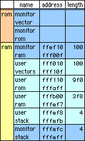
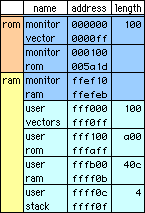

# H8 開発環境構築メモ
Hardware: AKI-H8/3048F, AKI-Mother Board, H8NIC (自作基板)


## [GNU Development Tools for the Hitachi H8/300[HS] Series](http://h8300-hms.sourceforge.net/)
いろいろ失敗しました。結局本家↑の通りにやったらうまくいきました。
version もこれと同じようにしました。比較的新しい方です。

```
$ uname -a:
Linux io.satellite 2.2.16-3 #1 Fri Aug 18 14:51:29 JST 2000 i686 unknown
TurboLinux Workstation 6.0 (FTP)
$ gcc --version
2.95.2
$ gmake --version
GNU Make version 3.79, by Richard Stallman and Roland McGrath.
Built for i386-pc-linux-gnu
```


## Install binutils, GCC, newlib

binutils
```
tar zxvf binutils-2.11.2.tar.gz
cd binutils-2.11.2
mkdir objdir
cd objdir
../configure --prefix=/usr/local --target=h8300-hms
gmake CFLAGS="-O2 -fomit-frame-pointer" all
gmake install
```
gcc and newlib
```
tar zxvf gcc-3.0.3.tar.gz
tar zxvf newlib-1.9.0.tar.gz
cd gcc-3.0.3
ln -s ../newlib-1.9.0/newlib .
patch -p1 < ../h8300-hms-gcc-3.0.3-1.patch
mkdir objdir #こうやって別のdir.でやらないとならなくなったそうです。
cd objdir
../configure \
        --prefix=/usr/local --target=h8300-hms \
        --enable-languages="c,c++" --with-newlib
gmake CFLAGS="-O2 -fomit-frame-pointer" all
gmake install #this has to be done by root
```
gdb
```
tar xfj gdb-5.1.1.tar.bz2
cd gdb-5.1.1
mkdir objdir
cd objdir
../configure --prefix=/usr/local --target=h8300-hms
gmake CFLAGS="-O2 -fomit-frame-pointer" all
gmake install #this has to be done by root
```
autoconf-2.13

gcc-2.8.1 の場合 make で autoheader がないと怒られたので autoconf を make install
```
$ csh ./configure
$ make
$ make check
# make install
```

## compile, assemble
Linux での assemble, compile, link 方法

from .asm
```
h8300-hms-as helloworld.S -o helloworld.o
h8300-hms-ld helloworld.o -o helloworld -T h83048F.x # requires linker script
h8300-hms-objcopy -O srec helloworld helloworld.mot
```

from C
```
h8300-hms-gcc -mh -c led.c -o led.o
h8300-hms-gcc -mh -S led.c #おまけ アセンブラ吐き出し led.s
h8300-hms-as crt0.s -o crt0.o #作っておく
h8300-hms-ld -T h83048F.x  crt0.o led.o -o led
(Link Linker Script, Start Up Routine,も一緒に)
h8300-hms-objcopy -O srec led led.mot
```
- ldscript: `h83048F.x`
- start up routine: `crt0.s`
は TECH I 『技術者のためのUNIX系OS入門』より


- `gcc -mrelax` を使うと良いかも。http://www.ertl.ics.tut.ac.jp/~muranaka/devel/
- `crt0.o` はアセンブルしておかなくても `gcc` で直接使える？


## ROM writers
hardware: AKI-H8/300H 3048F, AKI-H8 mother board

大抵の場合、最初に RAM に ROM 転送 program を書き込んでから、user の ROM program を書き込む。

### [h8tools](http://www.linet.gr.jp/~mituiwa/#h8dev2)
writer: `h8tools/3048eeprom`

`3048tool.c` 修正
```
97,103c97,103
<     tcsetpgrp(TheFd,getpgrp());
<     tcgetattr(TheFd,&TheTty);
<     cfsetispeed(&TheTty,<font color="red">B</font>9600);
<     cfsetospeed(&TheTty,<font color="red">B</font>9600);
<     TheTty.c_cflag |= HUPCL | CLOCAL ;
<     TheTty.c_cflag &= ~( PARENB | CSTOPB );
<     cfmakeraw(&TheTty);
```
ボーレート設定を確実に

http://www.paken.org/aaf/a4nerve/nerve.html
```
110,186c110,112
<     if(stty(TheFd, &TheTty ) == -1){
<       fprintf(stderr, "stty error\n" );
<       return -1;
<     }
<
<     for(i = 0;i < 64;i++) buffer[i] = 0;
<     do {
<       if((s = write(TheFd,buffer,64)) == -1) {
<           fprintf(stderr, "write error\n" );
<           exit(-1);
<       }
<       s = getb();
<     } while(s < 1);
< /*  return; */
```
return を comment out

http://strawberry-linux.com/h8/write.html
```
$ make # warningでるけど、Assembler Sourceを読んでもなんでか分からないから無視
# make install
$ gcc -o /usr/bin/3048tool 3048tool.c
$ 3048tool Motrola S2 File [ serial-port ]
```
Motorola S2 Fileは S"2" Formatしか受け付けない。
よって、S2を生成する必要がある。

- 方法0: 最初からS2になっている場合も良くある。
- 方法1: h8300-hms-gccで-mrelaxを付けるとアドレスを短くしようと努力してくれるらしい。
- 方法2
```
$ h8300-hms-objcopy -O srec --srec-forceS3 helloworld helloworld.mot3
$ ./s3tos2 helloworld.mot3 helloworld.mot2
$ 3048tool helloworld.mot2 /dev/ttyS0
```
`--srec-forceS3` で S3 Format を強制的に作り、
[s3tos2](http://www.niigata-pc.ac.jp/~namikata/freebsd/h8/soft.html) Sフォーマット変換ツール
で S2 に変換。

#### Motorola S format
addressの長さ
- S1: 16bit (16進で4文字)
- S2: 24bit (16進で6文字)
- S3: 32bit (16進で8文字)
おまけ: [mot-mode.el](https://gist.github.com/geodenx/7276295dcbcab209e4edf8fc9c0f46d5)

### [Open SH/H8 writer](http://www.linet.gr.jp/~mituiwa/h8/)
[追記] May 30, 2003

h8tools が version up したものが公開されました。
多くのデバイスに対応し、使い方も簡単なのでお勧め。

### `h8dld.c`
TECH I 『技術者のためのUNIX系OS入門』より

Motorola S formatとbinary両方受け付けるというけど…。失敗中。

以下失敗記録

AKI-H8のWriter Flashに付いていた3048.subをboot programとして利用
```
$ ./dh8dld 3048.sub program.bin
```
それぞれbinary フォーマットとSフォーマットに対応している。というのだけどなぁ。
```
$ h8300-hms-objcopy -O binary helloworld helloworld.bin
```
と、`helloworld.bin` を作ってみたけど、書き込み失敗

```
$ ./h8dld 3048.sub program.bin
```
でやってみたら書き込めた
```
$ ./h8dld helloworld.bin 3048.sub
      634/      634      100%
Bootstrap Download Done(aa)
Bootstrap Program Download done.
Please Hit Enter key to start  download rom program.
```
ここで普通に何か押すとしばらくして終る。

そこで、`3048.sub`をbinaryにしてhelloworldを`.mot`にすればいいのか。
`3048.sub`は`.mot`形式なのでこれからどうやって、binaryにすればいいの？
```
$ ./h8dld 3048.sub program.mot
```
も失敗。一個も書き込めない。

### [h8comm](http://iwatam-server.dyndns.org/hardware/h8comm/index.html)
ちょっと試したけど、失敗中。
これは.motではなくて.binを受け付けるらしい。


## Monitor
hardware: AKI-H8/300H 3048F (増設RAM無し)

### [h8tools](http://www.linet.gr.jp/~mituiwa/#h8dev2)
monitor: `h8tools/3048mon`
```
$ make
$ 3048tool h8mon.mot
$ h8term [/dev/ttyS0]
Power Reset
ようこそH8/3048Fモニターへ!!
H8/3048F> dump 0000

00000000 : 0000010000000100  0000010000000100
00000010 : 0000010000000100  0000010000000100
00000020 : 0000010000000100  0000010000000100
00000030 : 0000010000000100  0000010000000100
```

H8/3048F ldscript



monitor (3048mon)上で動くProgram (.mot)を作る。
[h83048Fmon.x](https://www.dropbox.com/s/a3xing6yv2go0vr/h83048Fmon.x?dl=0)
一部抜粋
```
MEMORY
{
    vectors : o = 0xfff010, l = 0x00100
    rom     : o = 0xfff110, l = 0x009f0
    ram     : o = 0xfffb00, l = 0x003f8
    stack   : o = 0xfffef8, l = 0x00004
}
```
Reference: `h8tools/3048mon/h8mon.x`

from .asm
```
$ h8300-hms-as helloworld.S -o helloworld.o
$ h8300-hms-ld helloworld.o -T h83048Fmon.x -o helloworld
$ h8300-hms-objcopy -O srec helloworld helloworld.mot
$ ./h8tools/h8term
H8/3048F> write helloworld.mot
(略)
H8/3048F> exec fff110
(LCDに表示)
```

from C
```
$ h8300-hms-gcc -mh -c led.c -o led.o # -mrelax?
$ h8300-hms-ld -T h83048Fmon.x crt0.o led.o -o led
$ h8300-hms-objcopy -O srec led led.mot # S1, S2 or S3?
```

```
$ ./h8tools/h8term
ようこそH8/3048Fモニターへ!!
H8/3048F> dump fff110

00FFF110 : 124587EEA18087FB  0726D00782196623
00FFF120 : 0900F9BB10087FDF  04007E270000FF2D
00FFF130 : 0108752F2C054B7D  2800E4DD3558FABE
00FFF140 : 2C00D3AD08C25D7B  8000EFFF94523FFB

H8/3048F> write led.mot
書き込み中................................
書き込みが終了しました。
H8/3048F> dump fff110

00FFF110 : 7A0700FFFEF85EFF  F1A040F401006DF6
00FFF120 : 0FF6FAFF6AAA000F  FFC86AAA000FFFC4
00FFF130 : FA236AAA000FFF64  790207D06BA2000F
00FFF140 : FF6AFAE16AAA000F  FF6001006D765470

H8/3048F> exec fff110
```
(LEDが点滅)
`helloworld.S`, `led.c`, `crt0.o` (TECH I 『技術者のためのUNIX系OS入門』より)

#### stack
- stack領域って？ldscriptでmonitor以外のところに割り当てたけどいいの？Vectorとか。割り込みはどうなるのか。

> なお、プログラムは、jsr命令で実行されますので、rts命令で モニターに戻ります。
を試してみる。今は強制終了で終らせている。というか、H8内部のProgramは周り続けている。

rtsってCだとどうするの？
```
asm("rts");
```
これで良いようです。

### Hitachi's monitor for AKI-H8
HitachiのWebからAKI-H8用のMonitor programをdownload。[akih8.zip](http://www.hitachisemiconductor.com/sic/jsp/japan/jpn/Sicd/Japanese/Seminar/down.htm)
`MONITOR.MOT` を焼き込む。（Motorola S1 formatなので、AKI-H8に付属していたWindowsのwriter (flash)を利用）

```
$ cu -l /dev/ttyS0 -s 19200
Connected.

(ここでAKI-H8の電源ON)
 H8/3048 Series Advanced Mode Monitor Ver. 2.2A
 Copyright (C) Hitachi, Ltd. 1995
 Copyright (C) Hitachi Microcomputer System, Ltd. 1995

: ?
 Monitor Vector 00000 - 000FF
 Monitor ROM    00100 - 05A1D
 Monitor RAM    FEF10 - FEFEB
 User    Vector FF000 - FF0FF

 .  : Changes contents of H8/300H registers.
 A  : Assembles source sentences from the keyboard.
 B  : Sets or displays or clear breakpoint(s).
 D  : Displays memory contents.
 DA : Disassembles memory contents.
 F  : Fills specified memory range with data.
 G  : Executes real-time emulation.
 H8 : Displays contents of H8/3042 peripheral registers.
 L  : Loads user program into memory from host system.
 M  : Changes memory contents.
 R  : Displays contents of H8/300H registers.
 S  : Executes single emulation(s) and displays instruction and registers.
: ~[localhost].

Disconnected.
```

ldscript



H8/3048 Series Advanced Mode Monitor Ver. 2.2A用

AKI-H8/3048F RAM増設無し
[h83048Fhmon.x](https://www.dropbox.com/s/fcpl628sfitf5u6/h83048Fhmon.x?dl=0)


#### kermit
cuでは貧弱というか、使い方が良く分からないのでkermitをinstall
cuだとFile転送 (~> filename)に時間がかかりすぎるし、ちゃんと書き込めてないかも。
http://www.tt.rim.or.jp/~hoso/H8/#kermit

[cku201.tar.gz](http://www.kermit-project.org/ckermit.html#source)
```
$ mkdir kermit
$ cd kermit
$ tar zxvf cku201.tar.gz
$ make linux
# make install
$ cp ckermit.ini ~/.kermrc
$ cat > ~/.mykermrc
set line /dev/ttyS0
set speed 19200
set ternubak bytesize 8
set command bytesize 8
set transmit prompt 0
SET CARRIER-WATCH OFF

$ h8300-hms-as chap2/helloworld.S -o helloworld.o
$ h8300-hms-ld helloworld.o -T h83048Fhmon.x -o helloworld
$ h8300-hms-objcopy -O srec helloworld helloworld.mot

$ h8300-hms-gcc -mh -c chap2/led.c -o led.o
$ h8300-hms-ld -T h83048Fhmon.x chap2/crt0.o led.o -o led
$ h8300-hms-objcopy -O srec led led.mot

$ kermit
Executing /root/.kermrc for UNIX...
Executing /root/.mykermrc...
?No keywords match - ternubak
Command stack:
  4. File  : /root/.mykermrc (line 3)
  3. Macro : XIF
  2. Macro : _xif
  1. File  : /root/.kermrc (line 767)
  0. Prompt: (top level)
Good Morning!
C-Kermit 8.0.201, 8 Feb 2002, for Linux
 Copyright (C) 1985, 2002,
  Trustees of Columbia University in the City of New York.
Type ? or HELP for help.
(/root/) C-Kermit>c
Connecting to /dev/ttyS0, speed 19200
 Escape character: Ctrl-\ (ASCII 28, FS): enabled
Type the escape character followed by C to get back,
or followed by ? to see other options.
----------------------------------------------------


 H8/3048 Series Advanced Mode Monitor Ver. 2.2A
 Copyright (C) Hitachi, Ltd. 1995
 Copyright (C) Hitachi Microcomputer System, Ltd. 1995

: L
C-\ C-c
(Back at io.satellite)
----------------------------------------------------
(/root/) C-Kermit>(/root/) C-Kermit>transmit led.mot # helloworld.motも同様に動作する
(/root/) C-Kermit>c
Connecting to /dev/ttyS0, speed 19200
 Escape character: Ctrl-\ (ASCII 28, FS): enabled
Type the escape character followed by C to get back,
or followed by ? to see other options.
----------------------------------------------------
  Top Address=FF000

  End Address=FF1FD

: g ff100
C-\ C-c
(Back at io.satellite)
----------------------------------------------------
(/root/) C-Kermit>quit
Closing /dev/ttyS0...OK
```
kermitを user で実行すると UUCP の `/var/lock` でだめと言われるので、rootで実行。`~/.mykermrc`, `~/.kermrc` の移動を忘れずに。

NMI 入力を行うとユーザプログラムを強制停止らしい。
```
: G 10100 [RET]
NMI（Abort Switch ON）入力
  Abort at PC=013014
  PC=013014  CCR=80:I.......  SP=00FFFF00
  ER0=00000000  ER1=00000000  ER2=00000000  ER3=00000000
  ER4=00000000  ER5=00000000  ER6=00000000  ER7=00FFFF00
```

### [h8term](http://www.niigata-pc.ac.jp/~namikata/freebsd/h8/soft.html)
`h8term.c` の device file nameを変更
```
#define DEVICE "/dev/ttyS0"
```

```
$ gcc -o h8term h8term.c
$ ./h8term 
************************
* H8 tiny Terminal     *
*    [ESC] key to menu *
************************

 H8/3048 Series Advanced Mode Monitor Ver. 2.2A
 Copyright (C) Hitachi, Ltd. 1995
 Copyright (C) Hitachi Microcomputer System, Ltd. 1995

: L
[Esc]
------------------ menu --------------------
    upload data       :1
    exit this program :2
    exit this menu    :esc
[2]
    Upload file name : led.mot
--------------------------------------------
  Top Address=FF000
  End Address=FF1FD
: g ff100
[Esc]
------------------ menu --------------------
    upload data       :1
    exit this program :2
    exit this menu    :esc
--------------------------------------------
```

#### Reference
- [3.1 リンカスクリプトって何?](http://iwatam-server.dyndns.org/hardware/h8comm/doc/CrossDevel-jp.html/ch-ldscript.html)
- http://www.niigata-pc.ac.jp/~namikata/freebsd/h8/h8ram.x
- http://www.niigata-pc.ac.jp/~namikata/freebsd/h8/
- [h8tools/3048mon/h8mon.x](http://www.linet.gr.jp/~mituiwa/)
- h83048F.x (TECH I 『技術者のためのUNIX系OS入門』より)

## GNU Assembler (GAS)
「AKI-H8マイコン専用マザーボード」のサンプル `MBTEST.MAR`を GAS に移植。[mbtest.s](https://www.dropbox.com/s/9zmorz0zej2hx9l/mbtest.S?dl=0)
```
$ h8300-hms-as mbtest.s -o mbtest.o
$ h8300-hms-ld mbtest.o -T h83048Fmon.x -o mbtest
$ h8300-hms-objcopy -O srec mbtest mbtest.mot
$ ./h8tools/h8term 
ようこそH8/3048Fモニターへ!!
H8/3048F> write mbtest.mot
書き込み中................................................................
書き込みが終了しました。
H8/3048F> exec fff110
```

移植前
```
SW_D .EQU H'FFEF10
```
移植後
```
SW_D = 0xFFEF10
```
.setや.equでもいける？

.BEQUを移植できないので、直Address指定
(GCCを使えば.BEQUを#defineできる。)

移植前
```
MOJI: .SDATA "AKI-H8 "
 .DATA.B 0x0CF,0x0BB,0x0DE,0x0B0,0x0CE
 .DATA.B 0x0DE,0x0B0,0x0C4,0x0DE
 .SDATA "1111 11111111   "
```
移植後
```
MOJI: .ascii "AKI-H8 "
 .byte 0x0CF,0x0BB,0x0DE,0x0B0,0x0CE
   .byte 0x0DE,0x0B0,0x0C4,0x0DE
 .ascii "1111 11111111   "
```
レジスタ名を小文字に変更: `ER1` -> `er1` など

`.SECTION` をcomment out
```
.global _start
```
など、`.global` を忘れずに(globalってなに？)
変数は `_start` とする(ldscript内で指定しているっぽい)。

### GCCでasemmber fileをassemble
[mbtest.S](https://www.dropbox.com/s/9zmorz0zej2hx9l/mbtest.S?dl=0)
```
$ h8300-hms-gcc -O -mh -mint32 -g -mrelax -nostdlib \
-T ../h83048Fmon.x mbtest.S -o mbtest.o
$ h8300-hms-objcopy -O srec mbtest.o mbtest.mot
$ ../h8tools/h8term
ようこそH8/3048Fモニターへ!!
H8/3048F> write mbtest.mot
書き込み中................................................................
書き込みが終了しました。
H8/3048F> exec fff110
```
`#define`でできました。
`filename.S` と大文字のSでないと `#define` で宣言したシンボルを利用するところでエラー。
```
$ man gcc
...
.s     アセンブリ言語ソースです。アセンブラにかけられます。
.S     アセンブリ言語ソースです。プリプロセッサ、アセンブラにかけられます。
...
```
`.end` の後は改行が必要。

移植前
```
LED1 .BEQU 0,P5DR
```
移植後
```
#define LED1 #0,@P5DR:8
```
bit命令 (BCLRなど)だったので、こうしたけど…。

(#include "file.h"も使えるかも。)

```
H' -> 0x
B' -> 0b
```

### [GCC options](http://www.ertl.ics.tut.ac.jp/~muranaka/devel/h8-gcc.txt)
http://lillith.sk.tsukuba.ac.jp/~kashima/aki-h8/
```
$ h8-gcc -T linker-script.x -nostartfiles -mh -mrelax \
-O2 -o out-file startup-file.o src-file1 src-file2 ...

-T linker-script.x : リンカスクリプトファイルの指定
-nostartfiles      : デフォルトのスタートアップルーチンを使用しない
-mh                : H8/300Hを指定
-mrelax            : 絶対アドレッシングを最適化
-O2                : 最適化レベル２
-o out-file.o      : COFF 形式出力ファイル名
startup-file.o     : 使用するスタートアップルーチン
src-fileX        : C言語、アセンブラソースファイルまたはオブジェクトファイル

Output memory map
$ h8300-hms-gcc -mh -o foo.coff -g -Xlinker -M foo.c -Ml,-T h83048Fhmon.x 2> Xlinker.log
$ h8300-hms-gcc -mh -o foo.coff -g -Xlinker -M foo.c \
-Ml,-T h83048Fhmon.x crt0.s 2> Xlinker_crt0.s.log

-Ml,option
-M

バイナリ出力ファイル変換
$ h8-objcopy -O srec coff-file srec-file.mot
-O srec         : モトローラSレコードフォーマットを指定
coff-file     : COFF 形式入力ファイル名
srec-file.mot     : Sフォーマットファイル出力ファイル名
```

### `a38h.exe` on wine
```
$ wine a38h.exe MBTEST.MAR
$ wine l38h.exe MBTEST.OBJ
$ wine c38h.exe MBTEST.ASM
```
で、`MBTEST.MOT` が生成される。


### Reference
- ["Using as  The GNU Assembler](http://www.gnu.org/manual/gas-2.9.1/html_mono/as.html)
- `h8tools/3048eeprom/writebyte.S` h8tools
- `hellowworld.S` TECH I 『技術者のためのUNIX系OS入門』
- `h8300-hms-gcc -mh -S led.c` で吐き出されたアセンブラ `led.s`
- 別のサンプル [3.S](https://www.dropbox.com/s/uipx94n0ww58cex/3.S?dl=0) SW, LED動作確認
