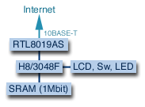
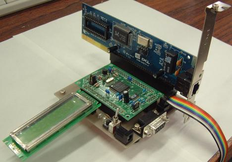
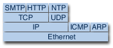
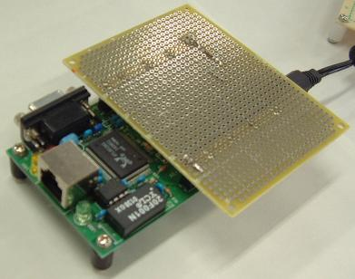

# H8NIC

秋月電子通商販売の H8/3048F マイコンボードと RealTek の ISA バス Ethernet コントローラ RTL8019AS を利用し、 ネットワークインタフェースカードを製作しました。
TCP/IP プロトコルスタックを実装したスタンドアロンプログラムを構築しました。現在、NTP (UDP) と HTTP, SMTP (TCP) まで実装できました。

We created a network interface card using Akizuki H8/3048F microcontroller board and RealTek ISA bus ethernet controller RTL8019AS. 
We made a stand alone program implementing TCP/IP protocol stack including NTP (UDP), HTTP, and SMTP (TCP).


## Hardware

以下は自作の H8NIC (AKI-H8/3048F + RTL8019AS) についての記述です。
マイコンは AKI-H8/3048F マイコンボードを利用しました。
H8 と RTL8019AS は ISA bus を使って接続します。今回は ISA bus NIC である PLANEX ENW-2401P-T を利用しました。

AKI-H8/3048F マイコンボートに 1Mbit SRAM (HM628128) を増設しました。
増設した SRAM は無くても動くと思いますが、動作確認はしていません。増設した SRAM 上に program を置き Monitor で動作させました。
文字表示用に LCD を接続します。プッシュスイッチと LED も付けました。

(追記) AKI-H8LAN キット (H8/3068F + RTL8019AS) に対応しました。

### Schematics
トランジスタ技術 2001年 9月号 第4章『H8/3067Fマイコンボードの設計＆製作』に掲載されている p. 184 図2、p.185 図4 と主要配線は同じです。
- 記事では H8/3067F を使用していますが、AKI-H8/3048F を使いました。
- RTL8019AS:`INT3` と H8/3048F:`IRQ1` を接続していますが、現在は未使用です。
- H8/3048F の CS1 に SRAM を、CS2 に RTL8019AS に繋ぎ NE2000 Register を割り当て、mode 5 で動作させます。
- 図3の RTL8019AS:`^WR`, `^RD`は 29, 30 pin となっていますが、実際は逆さだと思います。H8 との接続はあっています。
- LCD Character Display Module (16 characters x 2 lines) `SC1602BS` (秋月)を追加します。

接続 H8/3048F - LCD
```
PB0 - D4
PB1 - D5
PB2 - D6
PB3 - D7
PB4 - E
PB6 - Rs
PB7 - R/~W
```

- 確認用 LED を P4-0,P4-1 に接続
- NTP Request Packet 送信用の push switch を P4-3
- mail (SMTP) 送信用 push switch を P4-2
- C と R で時定数を付けた reset switch も付けました。Monitor での開発中に使いました。


### Evaluation Board

- PCB for UNIX: [h8nic4.pcb](https://www.dropbox.com/s/1pi9zu7p755lzwg/h8nic4.pcb?dl=0)
- pattern: [h8nic4_group1.pdf](https://www.dropbox.com/s/8zufmg603u7zz2t/h8nic4_group1.pdf?dl=0)
- silk: [h8nic4_componentsilk.pdf](https://www.dropbox.com/s/gjtog6ofyia06b6/h8nic4_componentsilk.pdf?dl=0)
- photo: [DSCF0045s.jpg](https://www.dropbox.com/s/ct2n51p73hmljyx/DSCF0045s.jpg?dl=0), [DSCF0046s.jpg](https://www.dropbox.com/s/4f4eky8y8eargv4/DSCF0046s.jpg?dl=0)
- Issue: RS232C の Rx, Tx が反対
- GNDパターンはありません。ベタグランドです。基板の製造方法によって GND が消えてしまいます。


## Software
TCP/IP protocol stack は TOPPERS/JSP の TCP/IP protocol stack routine をOS無しで動作するように移植しました。
TOPPERS/JSP のライセンスによると移植後の再配布は条件を満たせば可能ということなので公開することにしました。
現在 1Mbit SRAM を増設し、Hitachi の Monitor program によって、増設した SRAM 上で program を実行しています。
ROM 化または、その他の Monitor での動作は未確認です（ldscriptを書き換えれば動くと思います）。

AKI-H8LAN キットは HTTP, SMTP に対応しました。
SMTP は EEPROM や送信ボタンなどのハードウェアの増設が必要。(Jan 23, 2003)

### Protocol Stack

現在、UDP である NTP (Network Time Protocol), Echo,  TCP である HTTP, SMTP (Simple Mail Transfer Protocol) まで実装しています。
ARP (Address Resolution Protocol)は対応していますし、 ICMP (Internet Control Messege Protocol)のうち Ping 応答は実装済です。

### 開発環境
H8 用の GNU Tools です。[http://h8300-hms.sourceforge.net/](http://h8300-hms.sourceforge.net/)
この他多くのウェブページにおいてこの開発環境の構築方法が記載されています。
Monitor を含め開発環境を整える際のメモを[こちら](../dev_env)で公開しています。
この文書中の増設 RAM 用の Hitachi Monitor で開発、動作確認をしました。
尚、NTP client では GNUPro C Library の `char *ctime(time_t clock)` を利用するので、`newlib` を含めた開発環境の構築が必要です。

AKI-H8LAN キットでは Hitachi Monitor を動作させ DRAM 上で Program を実行しています。
Monitorは [hterm](http://www19.u-page.so-net.ne.jp/tc5/hamayan/hos-sh/hterm.html) を使わせて頂きました。

[RedBoot](http://sourceforge.jp/projects/ecos-h8/) 用の linkter script も追加しました。(Jan 23, 2003)
`Makefile` 中で linker script を指定してください。 
RedBoot では TFTP なども利用できるので大きなプログラムも転送が早いです。

### Source
[h8nic.tar.gz](https://www.dropbox.com/s/3f85vo5bvxa0x11/h8nic.tar.gz?dl=0) (Jan 24, 2003 update, RSCからCVSに移行) 
```
3048f.h
3067f.h
Makefile
TODO
arp.[ch]: ARP layer
crt0.s: start up routine
eeprom.[ch]: EEPROM device driver
ether.[ch]: Ethernet layer
h83048Frhmon.x: Hitachi Monitor用ldscript (H8NIC RAM増設 mode 5)
h83048From.x: ROM化ldscript (H8NIC RAM増設 mode 5)
h83068Fmon.x: Hitachi Monitor用ldscript (AKI-H8LAN用 mode 5)
h83068Fredboot.x: AKI-H8LAN用RedBoot用ldscript (AKI-H8LAN用 mode 5)
h83068From.x ROM化ldscript (AKI-H8LAN用 mode 5)
icmp.[ch]: ICMP layer
ip.[ch]: IP layer
itron.h: ITRON header file
lan-util.[ch]: LAN sub-routines
lcd.[ch]: LCD driver http://member.nifty.ne.jp/softbone/OneBoard/H8Template/ を参考にさせていただきました。
ne2000.[ch]: NE2000 driver
nic.c: main routine
ntp.[ch]: NTP layer
sci.[ch]: SCI driver http://www.ertl.ics.tut.ac.jp/~muranaka/h8/ を参考にさせていただきました。
tcp.[ch]: TCP layer (TCP, HTTP, SMTP)
tcpip.h: TCP/IP header
udp.[ch]: UDP layer
util.[ch]: utility sub routines
```

### Usage
source file 中の IP address, subnet mask, default gateway address (, NTP server address, SMTP server address, 送信先、元mail address) を書き換えてください。 

H8NIC, AKI-H8LANキット 共通
```
ip.c:46:unsigned long node_ip_addr = 0xAC151B16; /* 172.21.27.22 */
ip.c:47:unsigned long subnet_mask = 0xffffff00; /* 255.255.255.0 */
ip.c:48:unsigned long default_gateway = 0xAC151B01; /* 172.21.27.1 */
```

以下、SMTP, NTP のみ (AKI-H8LANはNTPは移植してません。また、SMTPは簡単なハードウェアの増設が必要。)
```
udp.c:121: unsigned long ntp_server = 0xD2ADA01B; /* ntp1.jst.mfeed.ad.jp 210.173.160.27 */
tcp.c:270: dest.ip = 0xD3848062; /* SMTP server */
tcp.c:281: send_tcp(&dest, (TCP_FLAG_ACK | TCP_FLAG_PSH), packet, "HELO bc.wakwak.com\r\n", 20); /* SMTP server */
tcp.c:285: send_tcp(&dest, (TCP_FLAG_ACK | TCP_FLAG_PSH), packet, "MAIL FROM:&lt;atsuya@mac.com&gt;\r\n", 28);
tcp.c:289: send_tcp(&dest, (TCP_FLAG_ACK | TCP_FLAG_PSH), packet, "RCPT TO:&lt;atsuya@mac.com&gt;\r\n", 26);

```

コンパイル、リンク、コンバートしてRAMに転送し、Monitor上で実行します。
```
$ vi Makefile # change ldscript path if needed
$ make smtp (SMTP client)
$ make http (HTTP server)
$ make ntp (NTP client (clock))
$ (kermit, hterm, h8term などsci通信Programで転送)
  H8/3048 Series Advanced Mode Monitor Ver. 2.2A
  Copyright (C) Hitachi, Ltd. 1995
  Copyright (C) Hitachi Microcomputer System, Ltd. 1995
 : l
     (転送 smtp.mot, http.mot, ntp.mot)
 : g 20100 (ldscriptがh83048Frhmon.xの場合)
     ...
     (smtp.motの場合、mail 送信用のpush switchを押すとmailが送信されます。
     P4DR.BIT.B5 = 0 の時、bootstrap-mode (送信先やIP addressの設定、EEPROMに保存)
     P4DR.BIT.B5 = 1 の時、bootstrap-mode (設定値をEEPROMより読みだし))
     (http.motの場合、BrowserでH8NICのIPを指定して見てください。http://192.168.0.43/ など)
     (ntp.motの場合、NTP Request Packet用のpush switchを押すとLCDが現在時刻から時刻を刻始めます。)
```

AKI-H8LAN キットの場合 
```
$ vi Makefile # change ldscript path if needed
$ make http # HTTP server
$ (hterm, kermit, h8term などsci通信Programで転送)
 H8/3067 Series Advanced Mode Monitor Ver. 2.2A
 Copyright (C) Hitachi, Ltd. 1995
 Copyright (C) Hitachi Microcomputer System, Ltd. 1995
: l
### upload (u), exit (q), exit this menu (esc) ###
    upload file name: http.mot
...............................................
  Top Address=400000
  End Address=FFC193
: g 400000
```

### EEPROM Device Driver

AKI-H8LAN キットの IC4 ソケット用の EERPOM (94LC64) のドライバを作成しました。`h8nic.tar.gz` 中にあります。 
キットの基板（新ロット）では SDA がプルアップされているだけです。I2C の推奨回路では I2C デバイスを並列に接続できるよう SCL もプルアップする必要があります。
A1 も浮いていますが GND に落し、A0, A1, A2 を 000 に設定しました。 


## References
- [H8開発環境構築メモ](../dev_env)
- トランジスタ技術 2001年 1月号, 9月号
- H8/3048シリーズ各種マニュアル
- [RTL8019AS Data sheet](http://www.realtek.com.tw/)
- [TOPPERS/JSP](http://www.ertl.jp/TOPPERS/)
- [GNU Development Tools for the Hitachi H8/300HS Series](http://h8300-hms.sourceforge.net/)
- [RedHat GNUPro Toolkit Manuals](http://www.redhat.com/docs/manuals/gnupro/)
- [RedHat 組み込み Download GNU Pro関連](http://www.jp.redhat.com/embedded/emb_download/)
- [マスタリングTCP/IP入門編](http://ssl.ohmsha.co.jp/cgi-bin/menu.cgi?ISBN=4-274-06453-0)
- [TCP/IP Illustrated, Volume 1:The Protocols W.Richard Stevens](http://www.pearsoned.co.jp/washo/inet/wa_int92-j.html)


## Contributors
- OKAZAKI Atsuya
- TOGAWA Satoshi
